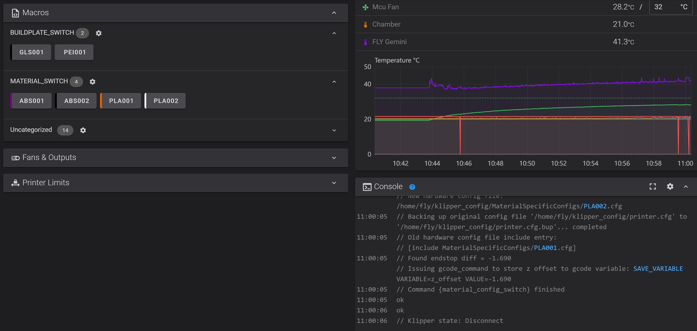
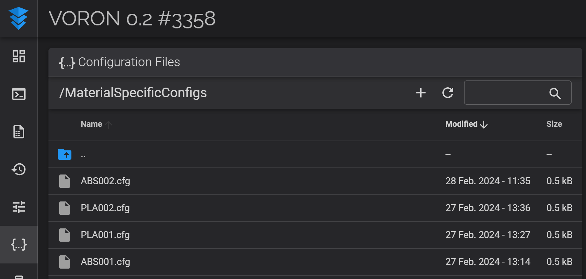
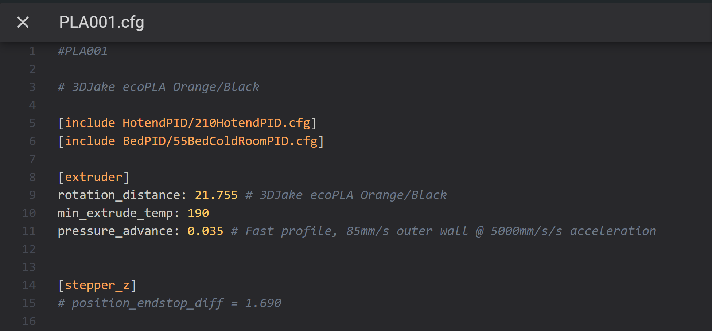
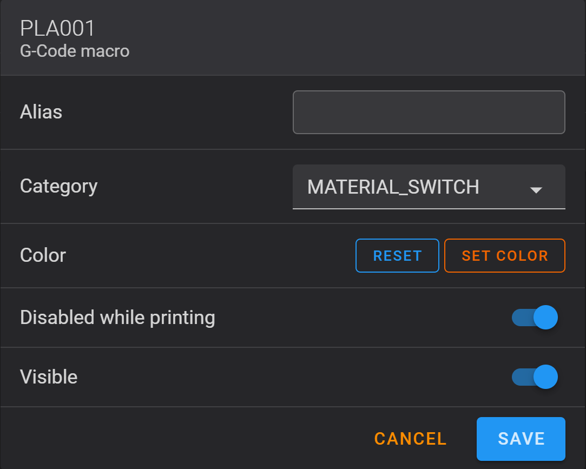
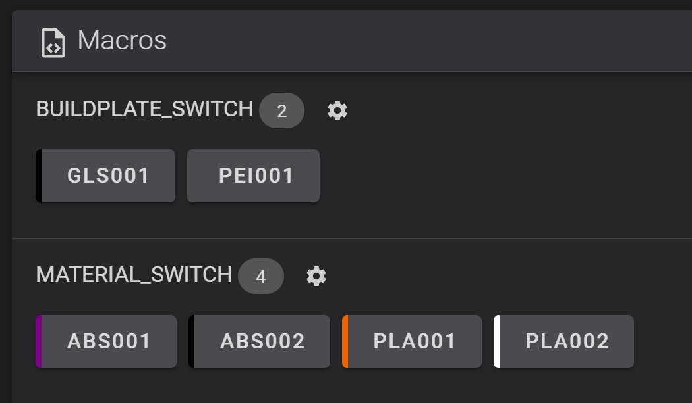

# Material configuration switch macros

I wanted to be able to switch between filaments without having to adjust filament dependent
settings such as pid values, z offset (squish), etc. by hand.
Most people achieve all or part of this functionality using their slicer, but I wanted something that worked regardless of the slicer used, and wouldn't have to depend on the gcode file.
The python script and configuration layout shown here achieve that with gcode macros and only one simple requirement utility.
This logic can be used to switch between other hardware as well, such as toolheads, nozzles, etc.



# Configuration file structure
Each material has its own configuration file.
We can choose what parameters change, such as hotend/bed temperature, 
pid values, or even things like minimum/maximum extrusion temperature.
Based on what parameters we choose this can also apply to
switching between toolheads, nozzles, etc.



printer.cfg now imports this file in the beginning, as such

`[include MaterialSpecificConfigs/PLA001.cfg]` 

Each material is identified by a material code. I write this code on the
spool with a sharpie, so I know which macro to use when I insert a new roll.
The default form is AAA999, but can be set in the "MATERIAL_CODE_REGEX" 
parameter in the script. Config files are named `MATERIAL_CODE.cfg`,
and contain a comment with their material code in the first line, like so:

`#PLA001`

Any value in the config files present in printer.cfg will be overwritten by the entry in 
the latter. Consult [LDO's guide on configuration read order](https://docs.ldomotors.com/en/guides/klipper_multi_cfg_guide#read-order)
if you want to change this behaviour in the script.

Take note that a backup of **printer.cfg** named **printer.cfg.bup** is created before the script modifies **printer.cfg**.

# Requirements:
- G-Code Shell Command Extension must be installed. 
For information on how to install please visit [kiauh's GitHub page](https://github.com/dw-0/kiauh/blob/master/docs/gcode_shell_command.md).

# Setup instructions:

  1. **BACKUP EVERYTHING!!! As with every extension that modifies your configuration directory,
it is recommended to fully back up your configuration directory before proceeding. And as 
always, USE AT YOUR OWN RISK! No guarantee comes with this software regarding safety.
Please review the code before using it!!!**

  2. Move whichever settings you change per material to a separate config file. You will need one config file for each material.

  3. Files must be named **{MATERIAL_CODE}.cfg**, and the first line must contain
    a comment with the same material code, as shown in the screenshot below. This is 
    done to make sure we don't use files which we did not create manually for these purposes.


  4. Download material_config_switch.py and place it in any directory. Take note of this path.

  5. Change "**MATERIAL_DIRECTORY**" to the directory containing your material specific configuration files.
Change "**PRINTER_CONFIG_FILE**" to printer.cfg's location.

  6. In your printer.cfg, add the following entry. This calls the driver script.
```cfg
[gcode_shell_command material_config_switch]
command: python3 {SCRIPT_LOCATION}
```

  7. Create a macro for each material, as such
```cfg
[gcode_macro PLA001]
gcode:
    RUN_SHELL_COMMAND CMD=material_config_switch PARAMS=PLA001
```
where "PLA001" is the material code.

### Important!!!
  8. **Make sure to enable `Disabled while printing` in order to not accidentally run 
this and restart klipper mid-print.**



You can also assign a colour to the macro, so all your colours are shown in the browser.

